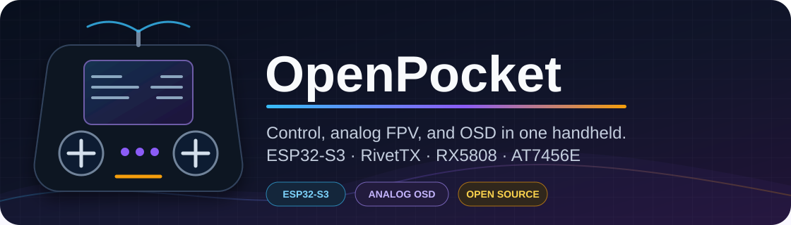
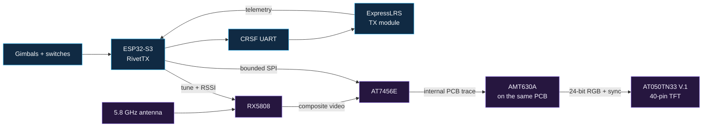

<p align="center">
  
</p>

<p align="center">
  <a href="https://github.com/Twotoz/OpenPocket/blob/main/LICENSE"></a>
  
  
  
  
  
</p>

<p align="center">
  <strong>A compact all-in-one ESP32-S3 handheld PCB combining RivetTX, ExpressLRS, RX5808 video, AT7456E OSD, and an AMT630A-driven 5-inch TFT.</strong>
</p>

<p align="center">
  <a href="#why-openpocket">Why OpenPocket</a> ·
  <a href="#architecture">Architecture</a> ·
  <a href="#hardware">Hardware</a> ·
  <a href="#build-path">Build path</a> ·
  <a href="#firmware">Firmware</a> ·
  <a href="#documentation">Documentation</a>
</p>

> [!CAUTION]
> OpenPocket is an engineering prototype, not a flight-proven product. Build
> the first revision on a current-limited bench supply. Keep propellers removed
> and mechanisms safe until your exact transmitter, failsafe, power system,
> RF link, and video chain have passed hardware-in-the-loop validation.

## Why OpenPocket

OpenPocket puts the controls, live analog FPV picture, and transmitter menus in
one compact handheld. It uses the existing RivetTX OpenPocket character
compositor unchanged and connects it to a physical AT7456E video-overlay
backend. The ESP32 never has to capture or process video pixels.

| | |
|---|---|
| **One handheld** | Gimbals, switches, ExpressLRS control, telemetry, video, and menus in a single enclosure. |
| **Purpose-built MCU** | ESP32-S3 provides the GPIO, native USB, and task separation needed by the complete controller. |
| **Low-latency video** | RX5808 composite video passes through the AT7456E into an AMT630A TFT controller without digital capture. |
| **Integrated snow-screen display** | The PCB-installed AMT630A keeps weak or lost analog video visible as noise instead of hiding it behind a blue screen. |
| **Native analog OSD** | PAL/NTSC autodetection, a 30×16 character grid, custom glyphs, delta updates, and video-loss recovery. |
| **Bounded background work** | OSD and receiver services cannot delay control, CRSF, or telemetry processing. |
| **Open development path** | Wiring, BOM decisions, bring-up evidence, and future KiCad sources live in this repository. |

## Architecture

The flight-control path stays short while video and presentation work run as
bounded services.



The 250 Hz control task owns channel output and safety. The OSD driver advances
a non-blocking state machine and writes only changed character runs. Video
loss, PAL/NTSC changes, or an absent OSD chip must never hold up the control
path.

## Hardware

| Component | Role |
|---|---|
| ESP32-S3-MINI-1U-N8 | PCB-installed RivetTX MCU, native USB, 8 MiB flash, no PSRAM |
| user-installed ExpressLRS nano receiver | four-wire full-duplex CRSF control and telemetry link |
| PCBWay-installed RX5808 module | tunable 5.8 GHz analog receiver, internal composite video, and RSSI |
| PCB-installed AT7456E | PAL/NTSC character overlay in the internal video path |
| PCB-installed AMT630A and flash | PAL/NTSC composite decoding and direct 24-bit RGB panel drive |
| AT050TN33 V.1-compatible TFT | user-plugged 40-pin panel; arbitrary 40-pin TFTs are unsupported |
| two dual-axis gimbals | four primary analog control axes |
| switches, menu buttons, and optional encoder | arming, AUX controls, navigation, and editing |
| validated regulators and protection | clean supplies sized for RF, display, video, and logic peaks |

The ESP32-S3 is the OpenPocket target. RivetTX may support smaller ESP32-C3
transmitters, but the C3 is not the reference platform for this handheld. See
[ADR-0001](docs/decisions/0001-esp32-s3.md) for the decision record.

## Analog OSD

The existing RivetTX compositor produces a hardware-independent 30-column by
16-row character frame. The AT7456E backend then provides:

- PAL/NTSC autodetection and safe standard changes without a reboot
- all 30×16 cells in PAL, with essential content held inside 30×13 for NTSC
- custom character uploads for icons, selection markers, and warnings
- shadow-frame comparison so unchanged cells generate no SPI traffic
- bounded asynchronous transfers instead of full-screen blocking redraws
- communication retry/backoff and redraw after video loss or recovery

The RX5808 feeds baseband video to the AT7456E over an internal PCB trace; the
AT7456E overlays text and passes it internally to the AMT630A, which drives the
edge-connected TFT directly. The user never wires composite video. The
AMT630A's internal OSD is not used for OpenPocket menus. See the
[complete wiring guide](docs/wiring.md).

## Build path

Bring up one subsystem at a time:

1. Review the [Revision-A engineering package](hardware/rev-a/README.md) and
   resolve every machine-readable release blocker.
2. Complete independent schematic, layout, sourcing, and Gerber reviews.
3. Assemble first articles through PCBWay with the RX5808 consigned/manual
   operation and no unapproved substitutions.
4. Power the board from a current-limited source and validate rails before
   inserting the TFT, battery, or ExpressLRS receiver.
5. Complete the factory and HIL gates before any propeller-on use.

The [bench build guide](docs/build-guide.md) contains the full sequence and
stop conditions. Do not order from provisional files or bypass the release
gate in `hardware/rev-a`.

## Firmware

OpenPocket runs the `main` branch of
[Twotoz/RivetTX](https://github.com/Twotoz/RivetTX):

```bash
git clone https://github.com/Twotoz/RivetTX.git
cd RivetTX
idf.py set-target esp32s3
idf.py menuconfig
idf.py build
idf.py flash monitor
```

Use RivetTX's checked-in `sdkconfig.openpocket-rev-a.defaults`; it contains the
authoritative no-PSRAM, 8 MiB flash configuration and GPIO map matching this
board. See the [firmware guide](docs/firmware.md) for the complete configuration.

## Documentation

| Document | Contents |
|---|---|
| [Bill of materials](docs/bom.md) | prototype parts, electrical requirements, and unresolved selections |
| [Wiring](docs/wiring.md) | ESP32-S3, RX5808, AT7456E, AMT630A, TFT, and ExpressLRS interconnects |
| [Bench build guide](docs/build-guide.md) | staged assembly sequence and stop conditions |
| [Firmware](docs/firmware.md) | ESP32-S3 target setup and RivetTX OSD configuration |
| [Bring-up checklist](docs/bring-up.md) | electrical, control, PAL/NTSC, failure-recovery, and endurance tests |
| [Architecture](docs/architecture.md) | task boundaries, character presentation, and video path |
| [ESP32-S3 decision](docs/decisions/0001-esp32-s3.md) | why OpenPocket standardizes on the S3 |
| [AMT630A display decision](docs/decisions/0002-amt630a-snow-screen.md) | why the display stage uses a snow-screen AMT630A board |
| [Hardware sources](hardware/README.md) | scope and release policy for future KiCad and production files |
| [Revision-A package](hardware/rev-a/README.md) | integrated board constraints, GPIO, power, BOM, factory test, and release gates |
| [AMT630A firmware](display/amt630a/README.md) | target behavior, provenance requirements, and deterministic build gate |

## Project status

RivetTX contains the character OSD and physical RX5808/AT7456E services, with
host coverage for PAL, NTSC, UI, tuning, scanning, RSSI, delta updates, glyphs,
loss/recovery, and failure isolation. Revision-A startup ordering, board power
policy, and the no-PSRAM pin/partition profile are under review.

No PCB order package is released yet. The exact panel datasheet, AMT630A
firmware rights/provenance, selected RX5808 consigned module, sourcing review,
KiCad ERC/DRC, Gerber inspection, and physical HIL evidence remain open. This
is intentionally an engineering prototype, not a production-ready product.

## Contributing

Issues, schematic reviews, module measurements, and focused pull requests are
welcome. Hardware findings must identify the exact module revision, voltage,
firmware commit, measurement point, and PAL/NTSC source. See
[CONTRIBUTING.md](CONTRIBUTING.md).

## License

OpenPocket documentation and future hardware sources are released under the
[MIT License](LICENSE). RivetTX is maintained in its own repository under its
own license.

---

<p align="center">
  <sub>Built for open hardware experimentation, low-latency analog FPV, and careful validation.</sub>
</p>
