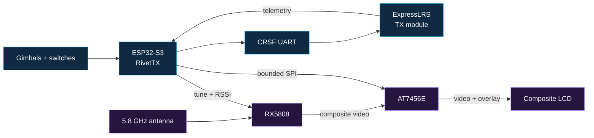

<p align="center">
  
</p>

<p align="center">
  <a href="https://github.com/Twotoz/OpenPocket/blob/main/LICENSE"></a>
  
  
  
  
  
</p>

<p align="center">
  <strong>An open ESP32-S3 handheld that combines RivetTX control, ExpressLRS, an RX5808 video receiver, and an AT7456E analog OSD.</strong>
</p>

<p align="center">
  <a href="#why-openpocket">Why OpenPocket</a> ·
  <a href="#architecture">Architecture</a> ·
  <a href="#hardware">Hardware</a> ·
  <a href="#build-path">Build path</a> ·
  <a href="#firmware">Firmware</a> ·
  <a href="#documentation">Documentation</a>
</p>

> [!CAUTION]
> OpenPocket is an engineering prototype, not a flight-proven product. Build
> the first revision on a current-limited bench supply. Keep propellers removed
> and mechanisms safe until your exact transmitter, failsafe, power system,
> RF link, and video chain have passed hardware-in-the-loop validation.

## Why OpenPocket

OpenPocket puts the controls, live analog FPV picture, and transmitter menus in
one compact handheld. It uses the existing RivetTX OpenPocket character
compositor unchanged and connects it to a physical AT7456E video-overlay
backend. The ESP32 never has to capture or process video pixels.

| | |
|---|---|
| **One handheld** | Gimbals, switches, ExpressLRS control, telemetry, video, and menus in a single enclosure. |
| **Purpose-built MCU** | ESP32-S3 provides the GPIO, native USB, and task separation needed by the complete controller. |
| **Low-latency video** | RX5808 baseband composite video passes through the AT7456E directly to the LCD. |
| **Native analog OSD** | PAL/NTSC autodetection, a 30×16 character grid, custom glyphs, delta updates, and video-loss recovery. |
| **Bounded background work** | OSD and receiver services cannot delay control, CRSF, or telemetry processing. |
| **Open development path** | Wiring, BOM decisions, bring-up evidence, and future KiCad sources live in this repository. |

## Architecture

The flight-control path stays short while video and presentation work run as
bounded services.



The 250 Hz control task owns channel output and safety. The OSD driver advances
a non-blocking state machine and writes only changed character runs. Video
loss, PAL/NTSC changes, or an absent OSD chip must never hold up the control
path.

## Hardware

| Component | Role |
|---|---|
| ESP32-S3 development board or module | RivetTX, inputs, UI, storage, USB, and hardware services |
| ExpressLRS TX hardware | full-duplex 3.3 V CRSF control and telemetry link |
| RX5808 module | tunable 5.8 GHz analog receiver, composite video, and RSSI |
| AT7456E OSD module | PAL/NTSC character overlay between the receiver and display |
| PAL/NTSC composite LCD | live FPV image and the complete OpenPocket interface |
| two dual-axis gimbals | four primary analog control axes |
| switches, menu buttons, and optional encoder | arming, AUX controls, navigation, and editing |
| validated regulators and protection | clean supplies sized for RF, display, video, and logic peaks |

The ESP32-S3 is the OpenPocket target. RivetTX may support smaller ESP32-C3
transmitters, but the C3 is not the reference platform for this handheld. See
[ADR-0001](docs/decisions/0001-esp32-s3.md) for the decision record.

## Analog OSD

The existing RivetTX compositor produces a hardware-independent 30-column by
16-row character frame. The AT7456E backend then provides:

- PAL/NTSC autodetection and safe standard changes without a reboot
- all 30×16 cells in PAL, with essential content held inside 30×13 for NTSC
- custom character uploads for icons, selection markers, and warnings
- shadow-frame comparison so unchanged cells generate no SPI traffic
- bounded asynchronous transfers instead of full-screen blocking redraws
- communication retry/backoff and redraw after video loss or recovery

The RX5808 feeds baseband video to the AT7456E; the AT7456E overlays text and
passes the result to the LCD. See the [complete wiring guide](docs/wiring.md).

## Build path

Bring up one subsystem at a time:

1. Read the [bill of materials](docs/bom.md) and record the exact revisions of
   every module.
2. Build and measure the protected 5 V and 3.3 V rails on a current-limited
   supply.
3. Add the ESP32-S3, controls, and ExpressLRS link with RF output constrained.
4. Prove the direct RX5808-to-LCD composite path in PAL and NTSC.
5. Insert the AT7456E, level shifting, and SPI control lines.
6. Configure RivetTX, then complete every item in the
   [bring-up checklist](docs/bring-up.md).

The [bench build guide](docs/build-guide.md) contains the full sequence and
stop conditions. Do not design a battery pack or order a PCB production run
from the provisional module-level BOM.

## Firmware

OpenPocket runs the `main` branch of
[Twotoz/RivetTX](https://github.com/Twotoz/RivetTX):

```bash
git clone https://github.com/Twotoz/RivetTX.git
cd RivetTX
idf.py set-target esp32s3
idf.py menuconfig
idf.py build
idf.py flash monitor
```

Enable `Use OpenPocket AT7456E analog OSD instead of SSD1306` under
`Component config -> RivetTX hardware`, then assign pins for the OSD, CRSF,
controls, and other peripherals. There is deliberately no universal GPIO map
until a specific ESP32-S3 module and reviewed schematic are selected. See the
[firmware guide](docs/firmware.md) for the complete configuration.

## Documentation

| Document | Contents |
|---|---|
| [Bill of materials](docs/bom.md) | prototype parts, electrical requirements, and unresolved selections |
| [Wiring](docs/wiring.md) | ESP32-S3, RX5808, AT7456E, ExpressLRS, and LCD interconnects |
| [Bench build guide](docs/build-guide.md) | staged assembly sequence and stop conditions |
| [Firmware](docs/firmware.md) | ESP32-S3 target setup and RivetTX OSD configuration |
| [Bring-up checklist](docs/bring-up.md) | electrical, control, PAL/NTSC, failure-recovery, and endurance tests |
| [Architecture](docs/architecture.md) | task boundaries, character presentation, and video path |
| [ESP32-S3 decision](docs/decisions/0001-esp32-s3.md) | why OpenPocket standardizes on the S3 |
| [Hardware sources](hardware/README.md) | scope and release policy for future KiCad and production files |

## Project status

RivetTX already contains the 30×16 OpenPocket menus and the physical AT7456E
backend, including host-side PAL, NTSC, navigation, warning, delta-update,
glyph-upload, video-loss, standard-change, and SPI-failure tests. RX5808 target
hardware, the final GPIO assignment, the reference schematic, PCB, power
system, and complete composite-video HIL evidence remain open engineering work.

No schematic, PCB, enclosure, or battery design is currently released as
production-ready. The hardware directory will become the authoritative source
for those files after design review and measurement.

## Contributing

Issues, schematic reviews, module measurements, and focused pull requests are
welcome. Hardware findings must identify the exact module revision, voltage,
firmware commit, measurement point, and PAL/NTSC source. See
[CONTRIBUTING.md](CONTRIBUTING.md).

## License

OpenPocket documentation and future hardware sources are released under the
[MIT License](LICENSE). RivetTX is maintained in its own repository under its
own license.

---

<p align="center">
  <sub>Built for open hardware experimentation, low-latency analog FPV, and careful validation.</sub>
</p>
